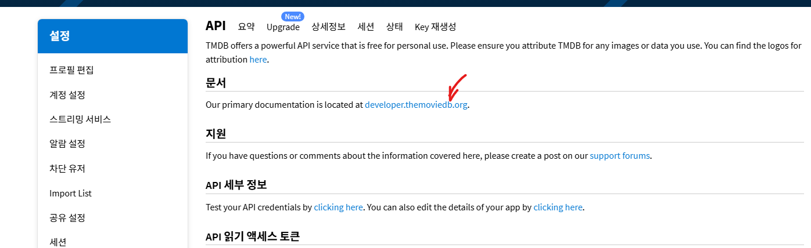
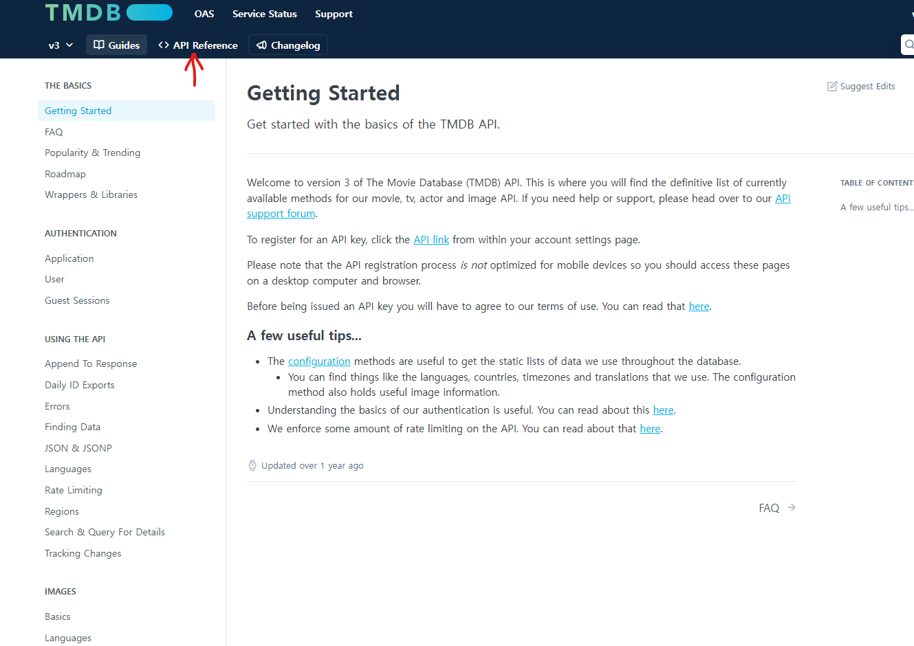

# 01-pjt

## problem d (casting info)
casting information 이 movie URL 밑의 credits 밑에 있다는 사실을 copilot 이 알려줬다.

구글링을 해보니, [개발자용 TMDB  참고 사이트](https://developer.themoviedb.org/reference/configuration-details) 에 들어가보고 사용법을 알 수 있었다.

알고 보니 해당 문서는 다음 경로로 들어가면 나온다.






## problem b
```python
params = {
  'api_key': api_key,
  'language': language
}
response = requests.get(url, params=params)
if response.status_code == 200:
  data = response.json()
  genres = '. '.join([g['name'] for g in data.get('genres', [])]) # 없으면 빈 리스트 ([]) 반환
  revenue = data.get('revenue') # 없으면 None 반환

  # reader = csv.DictReader(opened_file) 로 해야 원하는 값 잡기 쉬움
  # csv.writer 객체를 만들고 .writrow 로 값 추가
```

## problem c

```python
response = requests.get(url, params=params)
if response.status_code == 200:
  reviews = response.json().get('results', [])

for review in reviews:
  rating = review.get('author_details', {}).get('rating')
```

내용 없는 경우를 제외해야 한다는 것을 알았다. 
`if not content or content.strip()=="":` 은 내용이 없다고 표시하거나 제외하였다.

## problem e
```python 
reader = csv.DictReader(file)
for row in reader:
  try:
    rating = float(row['rating'])
  except (ValueError, TypeError):
    rating = None


def calculate_rating_distribution(reviews, movie_id):
    distribution = {str(i): 0 for i in range(1, 11)}
    for review in reviews:
        if review['movie_id'] == movie_id and review['rating'] is not None:
            rating_int = int(round(review['rating']))
            if 5 <= rating_int <= 10:
                distribution[str(rating_int)] += 1
    # 평점 분포를 "1:2,2:0,3:1,..." 형태의 문자열로 반환
    return ','.join([f"{i}:{distribution[str(i)]}" for i in range(1, 11)])
```

# 문제 상황
## API 중 특정 값을 찾지 못하는 현상
- 리뷰 데이터를 수집한 뒤 평점이 5점 이상인 리뷰를 필터링하기 위하여 평점을 받아온 뒤 해당 리뷰들을 필터링 해야 함
- 결과물을 찾지 못함
## 문제 해결 시도
- 탐색이 정상적으로 이루어지고 있는지 확인
- API 키를 정상적으로 받아오고 있는지 확인
- TMDB에 현재 사용중인 키 외에 다른 키로 접근할 수 있는지 확인
## 찾아본 다른 방법들
- TMDB에서 다른 평점값들을 찾아봄
- 모수가 너무 작아 문제였으므로 모수를 키움
- 값을 찾을 수 없을때도 인식할 수 있도록 값이 없을 경우에 대한 처리를 추가